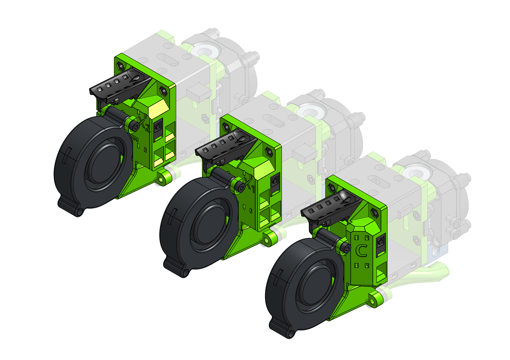
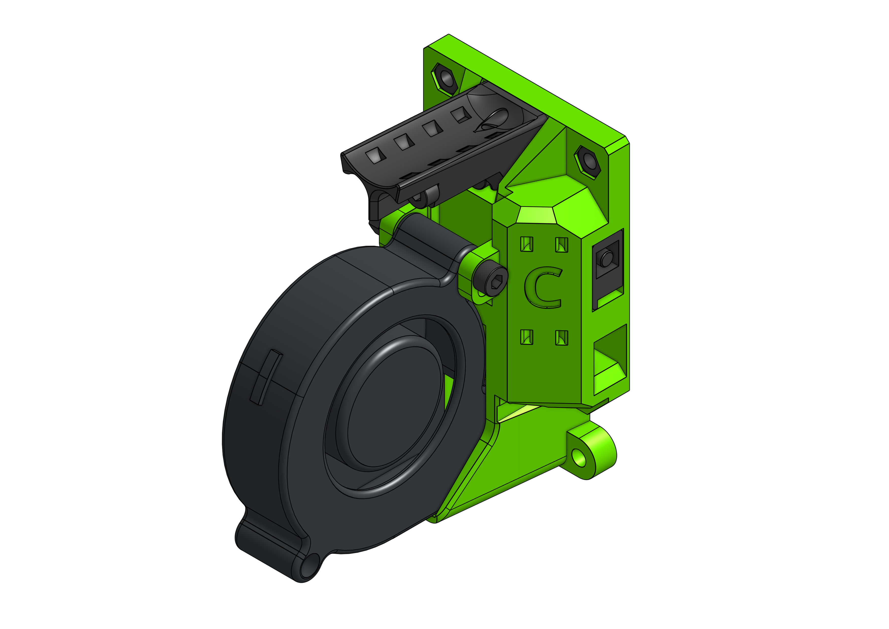
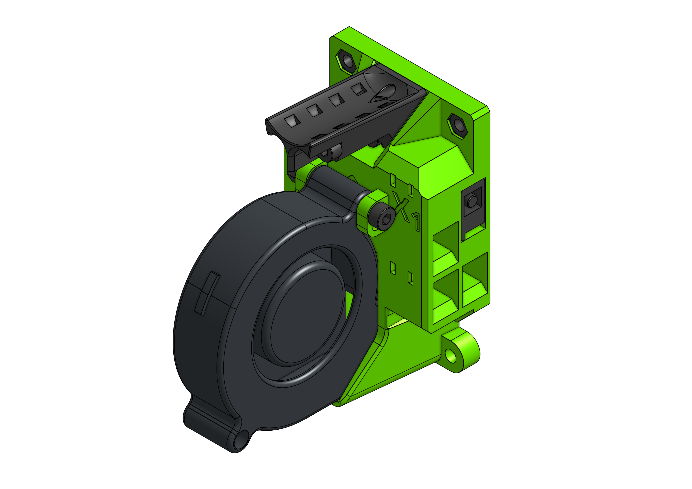
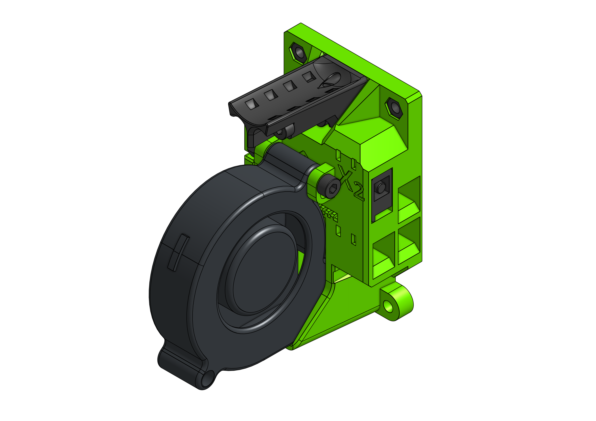

# Cartesian and IDEX support

EVA 2 supports not only CoreXY printers. You can also use it on a 6mm cartesian or even IDEX system.

??? warning "IDEX Z offset caveat"

    Z offset regulation is not figured out yet - as of today the assumption (as unrealistic as it maybe) is that the tips of both nozzles are at the same Z offset.

??? info "Front belt holders"

    On a cartesian/IDEX type EVA the front belt holders are reundant - there are no belts in the front.

!!! success "V-cast users"

    If you are a user of a standard, MGN15 V-cast user and fill quite lost in the new EVA 2 submodule system then think about what you need:

    - your choosen EVA drive, e.g. [BMG](../../drives/bmg/)
    - the [MGN15 addon](../mgn15/) - since V-cast is MGN15
    - this addon for your Cartesian/IDEX printer

### Links

{{ eva_download_button("cartesian_idex") }}

{{ eva_link("cartesian_idex") }}

{{ onshape_link("cartesian_idex") }}

### BOM

=== "Cartesian"

    

{{ bom("addons/cartesian_idex/bom/cartesian.csv", 4) }}

=== "IDEX X1"

    

{{ bom("addons/cartesian_idex/bom/idex_x1.csv", 4) }}

=== "IDEX X2"

    

{{ bom("addons/cartesian_idex/bom/idex_x2.csv", 4) }}
